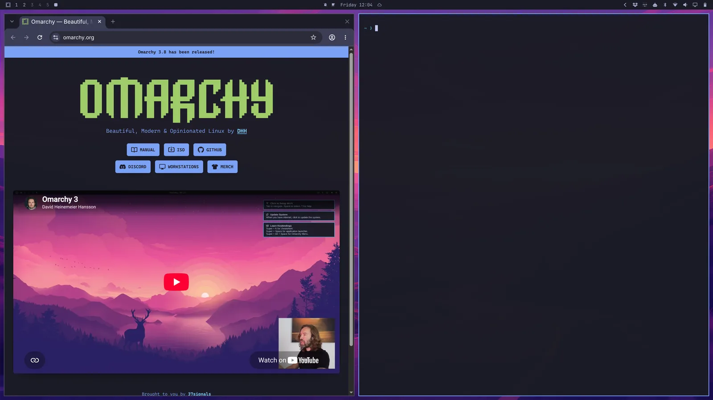
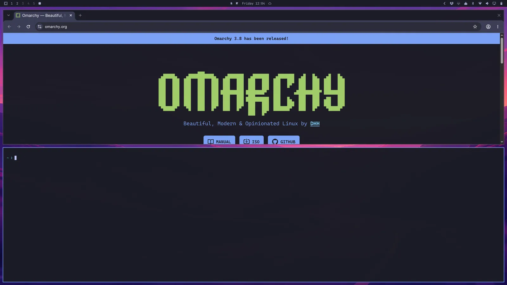
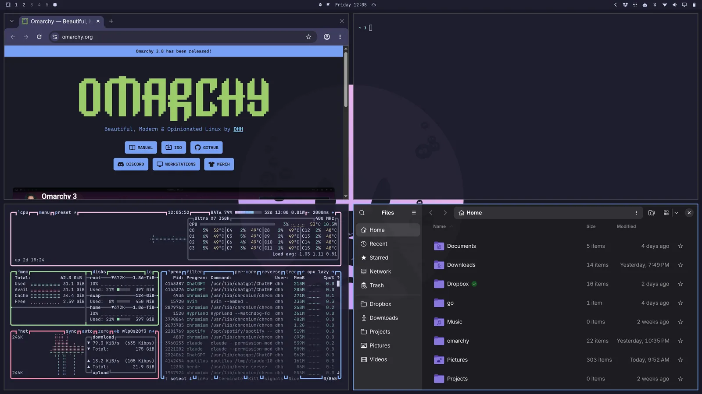
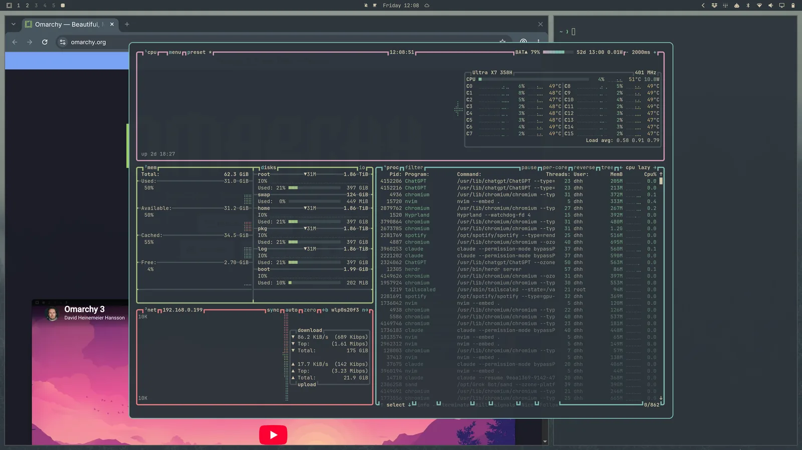

# 导航操作

在 codeOS 中，一切操作都通过键盘完成——_一切！_ 系统刚启动时，你真的没法只用鼠标做任何事情。但按 `Super + Space` 可以打开 codeOS 菜单，从这里你几乎可以做任何事。

不过 codeOS 菜单并不是大多数时候操作系统的主要方式。我们可以更快！所有最重要的应用都直接绑定了独立的快捷键。按 `Super + Return` 启动终端，按 `Super + Shift + Return` 启动浏览器。试着先后按下这两个快捷键，你就会亲眼看到 Hyprland tiling 的神奇效果：

 

然后按 `Super + J`，它们就会从并排改为上下堆叠：

 

再按一次 `Super + J` 就恢复并排。然后试试在浏览器窗口中按 `Super + Shift + Arrow Right` 交换窗口位置。

现在按 `Super + Ctrl + T` 启动 Activity monitor。它会以浮动窗口的形式出现。你可以用 `Super + T` 把它变成 tiling 窗口（再按一次变回浮动）。接着按 `Super + Shift + F` 打开文件管理器。你就会看到一个整洁的四宫格布局：

 

用 `Super + Arrow` 在窗口之间切换焦点。这会同时把鼠标指针移到新应用的中心位置。

如果按 `Super + Shift + 2`，当前获得焦点的应用就会被移到第二个 workspace。`Super + Shift + 1` 把它移回来。（而 `Super + Shift + Alt + 2` 会把当前应用移到第二个 workspace，但不切换过去。）

按住 `Super` 的同时用鼠标点击窗口，可以重新排列窗口位置。按住 `Super` 同时用鼠标右键拖动，可以自由调整窗口大小。

按 `Super + W` 或 `Super + Q` 关闭窗口（按 `Ctrl + Alt + Delete` 关闭所有窗口）。

也可以按 `Super + F` 进入全屏，或者按 `Super + Alt + F` 进入保留顶栏的半全屏，或按 `Super + Ctrl + F` 在窗口内全屏播放（看 YouTube 超好用！）。

### Dwindle 与 Scrolling 布局

codeOS 的默认布局叫做 dwindle。它会让你在同一个 workspace 打开的所有窗口始终保持可见，即使需要缩小它们的尺寸。

 

你也可以选择把某个 workspace 切换到 scrolling 布局，窗口会并排排列，超出显示器的可视边缘。通过 `Super + L` 将当前 workspace 切换到这种布局。

 

这个选择是按 workspace 独立保存的，会持续生效。所以你可以让 workspace 1 保持 dwindle 用来浏览网页，workspace 2 用 scrolling 来写代码，重启后仍然是这样。（同一个切换选项也在 codeOS 菜单的 _Trigger > Toggle > Workspace Layout_ 下。）

如果你想把 scrolling 布局设为默认，可以在 `~/.config/hypr/looknfeel.lua` 中设置：

```lua
hl.config({
  general = {
    layout = "scrolling",
  },
})
```

### 窗口分组

可以用 `Super + G` 对窗口进行分组。进入分组状态后，你启动的每个窗口都会自动加入该组。用 `Super + Ctrl + Arrow Left/Right` 在分组内的窗口之间切换，或用 `Super + Alt + 1/2/3/4` 直接跳转到指定顺序的分组窗口。

按 `Super + Alt + G` 可以把某个窗口移出分组，或者再按一次 `Super + G` 解散整个分组。也可以用 `Super + Alt + Arrows` 把分组外的窗口移入分组。

### 弹出窗口

按 `Super + O` 可以把窗口从当前 workspace 的 tiling 布局中"弹出"。弹出后它会变成浮动窗口，并且无论你切换到哪个 workspace，它都会跟着你。非常适合视频播放器之类的应用。

 

### Scratchpad 工作区

最后，还有一个特殊的 scratchpad 工作区，它会从屏幕上方下拉覆盖当前的 workspace，很像 Quake 的控制台。用 `Super + Grave` 或 `Super + S` 切换它的显示，用 `Super + Shift + Grave` 或 `Super + Alt + S` 把窗口放进去。

它特别适合运行 agent 的终端，或者那些你想快速交互但不想离开当前 workspace 的控制面板。要把窗口从 scratchpad 移走，直接用 `Super + Shift + 1` 之类的快捷键把它发到其他 workspace 即可。

### 需要慢慢习惯！

用这种方式导航桌面确实需要花点时间适应，但一旦你习惯了，就会发现再回到传统的鼠标驱动桌面体验会非常困难！
