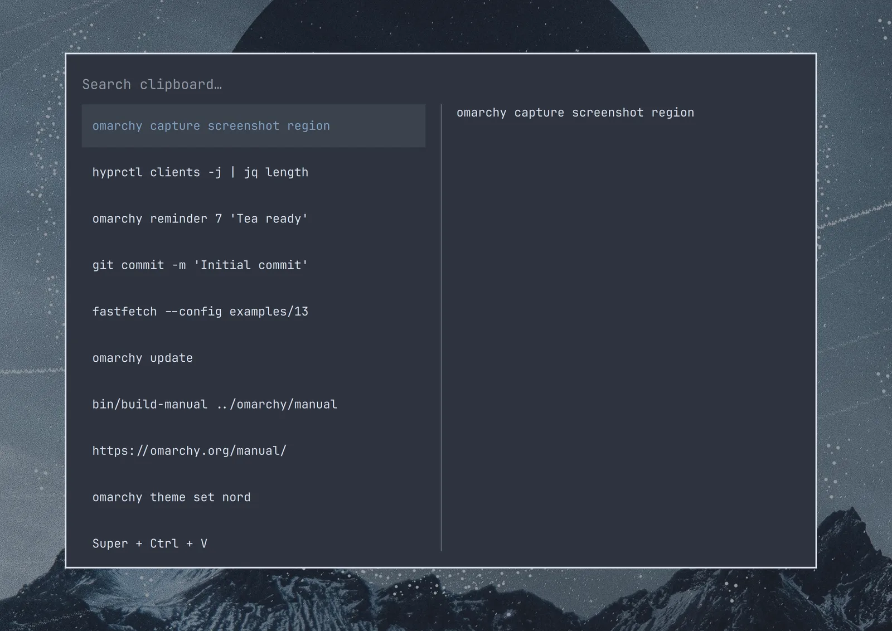

# 统一剪贴板与历史

通常在 Linux 上，你需要 `Ctrl + Shift + C/V` 在终端里复制粘贴，`Ctrl + C/V` 在其他地方。对没在 Linux 上长大的人来说太难适应了！从 Mac 过来的话，从 Super 切换到 Ctrl 也一样。

codeOS 用统一的剪贴板快捷键解决了这两个问题，它们（几乎）在任何地方都能用：

| 快捷键 | 操作 |
| ------- | ----------- |
| Super + C | 复制 |
| Super + X | 剪切 |
| Super + V | 粘贴 |
| Super + Ctrl + V | 剪贴板历史 |

_注意：大多数 AI Agent 框架里，粘贴图片用 `Ctrl + V`，但粘贴文字用 `Super + V`。_

### 剪贴板历史

剪贴板历史由 codeOS Shell 提供，文字和图片都支持。按 `Super + Ctrl + V` 打开，用回车选中条目，它就会放到剪贴板上，之后按 `Super + V` 粘贴。

 

直接开始输入就能搜索历史：

 
