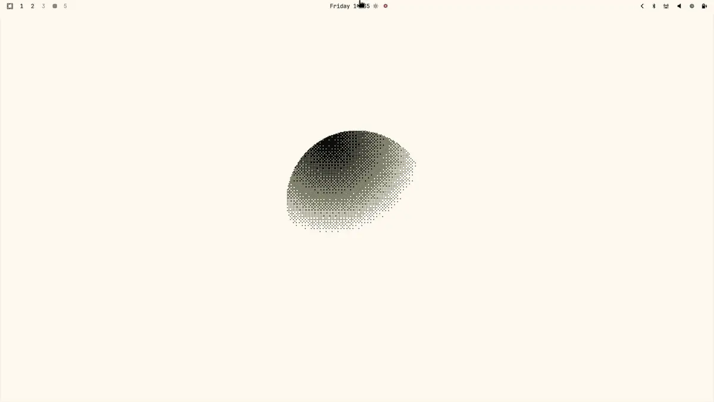

# 提醒

codeOS 内置了简单的倒计时提醒功能，可以带消息。按 `Super + Ctrl + R` 设置，按 `Super + Ctrl + Alt + R` 查看所有已设置的提醒，按 `Super + Ctrl + Shift + R` 清除全部。也可以通过 _Trigger > Reminder_ 菜单操作。CLI 用法：`omarchy reminder 7 'Tea ready'`。

 
