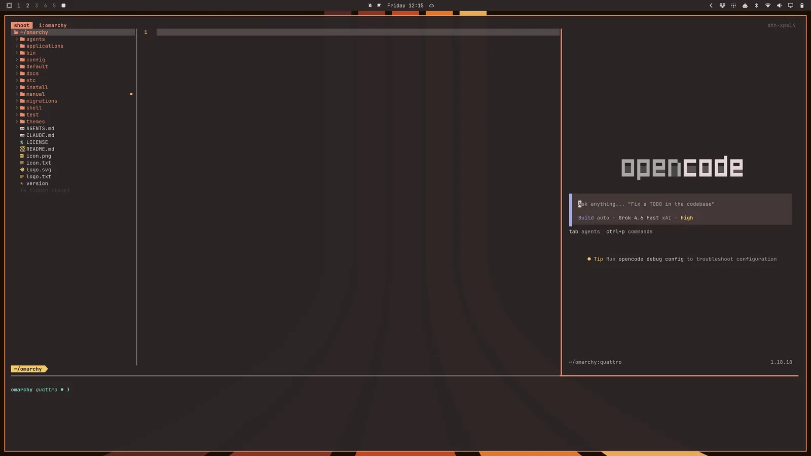
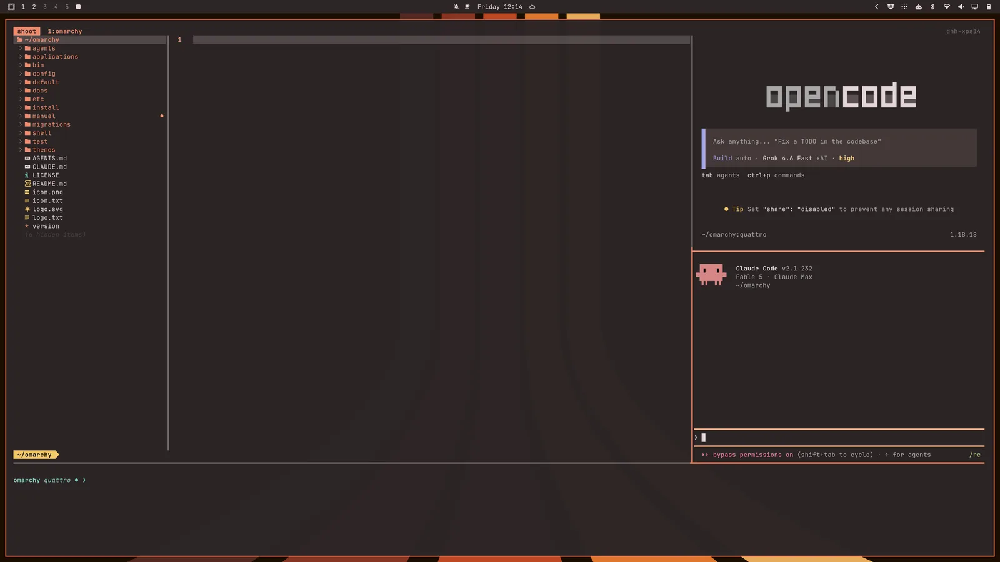
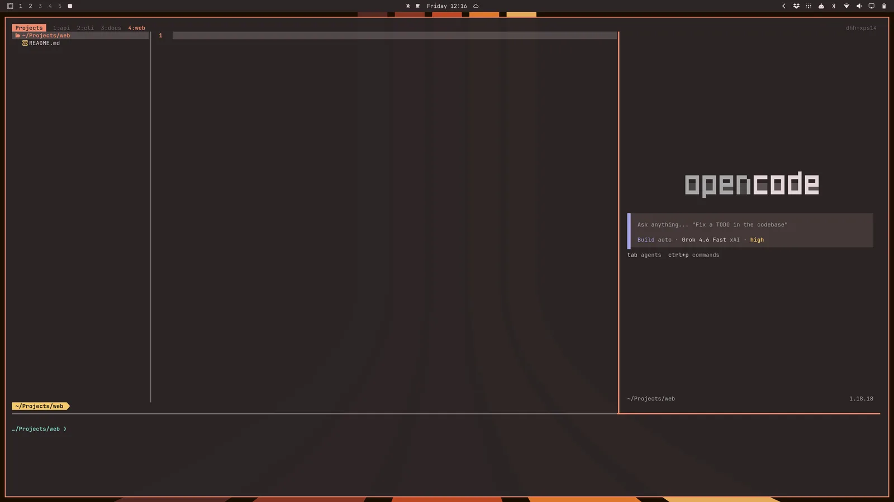

# 终端

[Foot](https://codeberg.org/dnkl/foot) 是 codeOS 的默认终端。它快速、轻量，老电脑也跑得动。但它不支持原生标签页或分屏。

如果你用 Tmux，那完全没问题；如果不用，我们也完整支持 _Alacritty_、_Ghostty_ 和 _Kitty_ 作为备选。在 codeOS 菜单的 _Install > Terminal_ 下选你偏好的。

按 `Super + Return` 打开新终端。（这个绑定会自动指向你通过 _Install > Terminal_ 安装的那个终端，可以在 _Setup > Defaults > Terminal_ 切换已安装的终端。）

## Tmux

Tmux 提供了一个一致的可编程界面来管理分屏、窗口（即标签页）和可恢复的会话，不管你用什么终端。它甚至可以在远程主机上工作——SSH 连服务器时也能用同样的方式。

按 `Super + Alt + Return` 在新终端里启动 Tmux 会话。因为 Tmux 是持久进程，就算你关了那个终端也能恢复会话。按 `Ctrl + Space`（叫前缀键）再按 `s` 就能看到所有活跃会话。

codeOS 自带一份经过人体工学优化的 Tmux 配置，有很多快捷键要记——所以 [快捷键速查表](07-hotkeys.md#tmux) 要放在手边。

## Tmux 布局函数

因为 Tmux 可编程，我们可以用函数来创建布局。codeOS 自带四个常用开发者布局函数。

`tdl [agent]` 启动一个三栏 IDE 风格的分屏：左边 `$EDITOR`，右边 AI Agent（比如 `c` 是 opencode、`cx` 是 Claude、`codex` 是 OpenAI），底部是终端。

所以 `tdl c` 会启动这样的布局（或者直接 `ic`）：

 

也可以用 `tdl c cx` 启动两个 Agent（opencode + claude）（或者直接 `icx`）：

 

还有 `tds`，启动一个四宫格：左上编辑器、右上实时 diff 观察器、左下终端、右下 opencode。

也可以用 `tdlm [agent]` 为当前目录的每个子目录创建一个这样的布局窗口，然后用 `alt + 1/2/3/4/5/...` 切换：

 

最后，用 `tsl [panes] [command]` 启动一群 Agent。比如 `tsl 4 c` 会给你一个四宫格的 opencode Agent：

 
