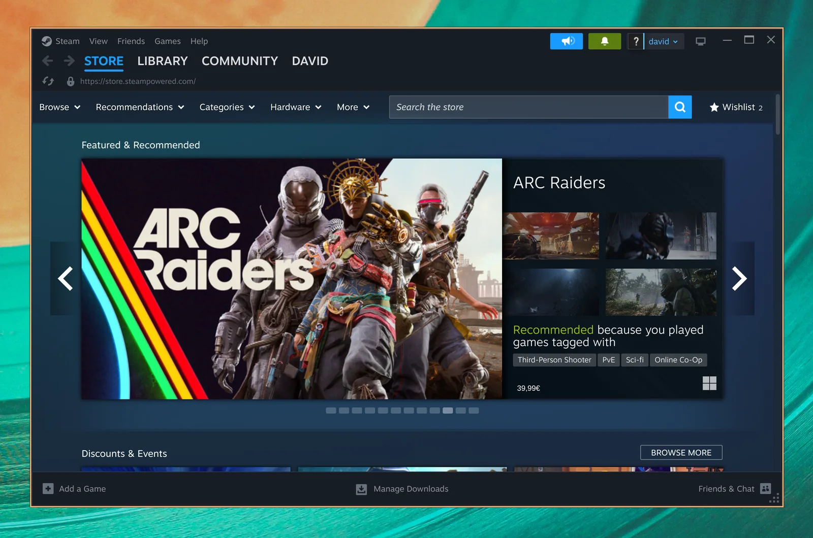
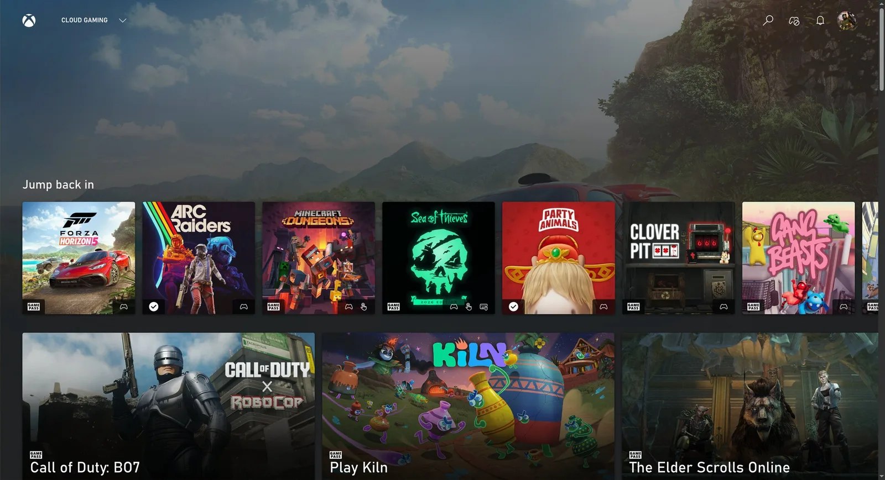
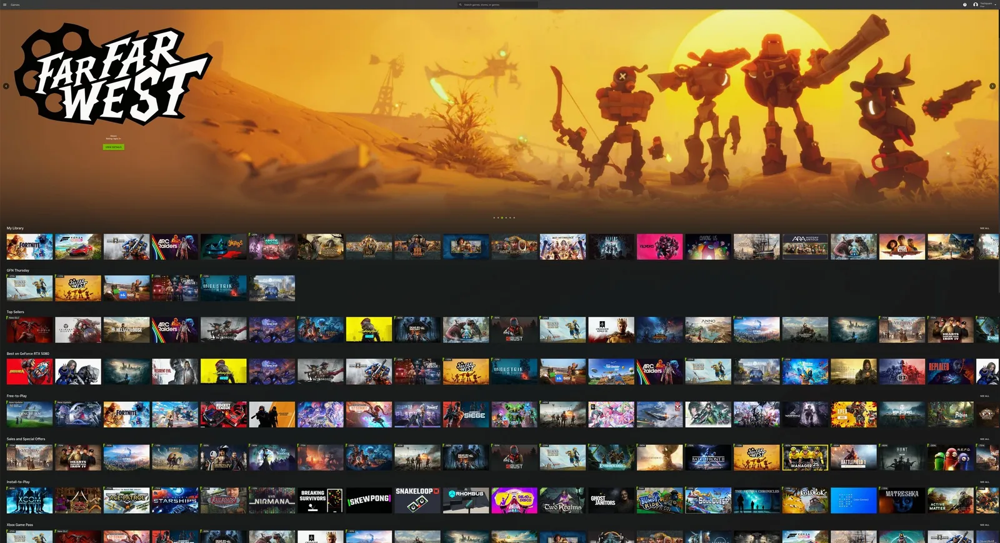

# 游戏

codeOS 不止用来 "提升生产力"，也用来玩——有什么比游戏更好玩的？codeOS 预装了一整套游戏选项——Steam 和 RetroArch 玩原生和复古游戏，Battle.net、Lutris 和 Heroic 玩非 Steam 商店的，Moonlight 做 PC 串流，Xbox Cloud Gaming + NVIDIA GeForce NOW 玩云游戏，还有常青树 Minecraft。

感谢 Valve 在 [Proton 兼容层](https://en.wikipedia.org/wiki/Proton_(software)) 上的出色工作，现在有成千上万款现代游戏可以在 Linux 上玩。对了，你知道 [Steam Deck](https://store.steampowered.com/steamdeck/) 其实跑的就是 Arch 吗！

所有游戏安装器都在 codeOS 菜单（`Super + Space`）的 _Install > Gaming_ 下。想卸载的话 _Remove > Gaming_。

## Steam

从 codeOS 菜单（`Super + Space`）的 _Install > Gaming > Steam_ 安装 [Steam](https://store.steampowered.com/)。

装好后，按 `Super + Space` 就能启动 Steam。

注意 Steam 启动可能需要 10-20 秒，而且加载过程中没有任何视觉反馈。

 

## RetroArch

从 codeOS 菜单（`Super + Space`）的 _Install > Gaming > RetroArch_ 安装 [RetroArch](https://www.retroarch.com/)。全套 libretro 核心都带，所有经典系统都覆盖了。

RetroArch 已经预配置好漂亮的 CRT Royale 着色器，完美还原复古感觉。

上手步骤：

1. 把 BIOS 文件放到 `~/Games/bios`，ROM 放到 `~/Games/roms`。
2. 按 `Super + Space` 输入 `retro` 启动 RetroArch。
3. 扫描 `~/Games/roms` 目录，开始玩。

也可以用 _Install > Gaming > RetroArch Game Launcher_ 给喜欢的游戏单独加一条应用启动器条目，选好核心和 ROM，之后从 `Super + Space` 直接进游戏。

 

## Xbox Cloud Gaming

从 codeOS 菜单（`Super + Space`）的 _Install > Gaming > Xbox Cloud Gaming_ 安装 Xbox Cloud Gaming web 应用。它"只是"该服务的 web 应用，但启动快，1080p 体验好。

如果你已经有 Xbox Game Pass，这是在 Linux 上玩 Fortnite 和其他不能原生运行的游戏的好办法。

 

## NVIDIA GeForce NOW

从 codeOS 菜单（`Super + Space`）的 _Install > Gaming > NVIDIA GeForce NOW_ 安装云游戏服务 [NVIDIA GeForce NOW](https://www.nvidia.com/en-us/geforce-now/)。另一个玩 Linux 上没有原生版本的游戏的好办法。

 

## Minecraft

从 codeOS 菜单（`Super + Space`）的 _Install > Gaming > Minecraft_ 安装 Minecraft。

和 Steam 一样，注意登录或启动后可能要等一会儿才会到下一个屏幕，等待过程中没有反馈。

 

## Xbox 手柄支持

从 codeOS 菜单（`Super + Space`）的 _Install > Gaming > Xbox Controllers_ 安装蓝牙 Xbox 手柄支持。通过蓝牙配对（`Super + Ctrl + B`）后，所有游戏里都能用。如果只是用 USB-C 线缆硬连接，不需要这一步。

## Moonlight（从 PC 串流游戏）

[Moonlight 客户端](https://github.com/moonlight-stream/moonlight-qt) codeOS 已经预装了，所以你可以立刻从运行着 [Sunshine](https://app.lizardbyte.dev/Sunshine/) 的 Windows PC 串流游戏。从 `Super + Space` 启动 Moonlight。

如果你的 codeOS 机器和远程游戏 PC 都是硬连线网络，体验和本地玩没区别。分辨率调到原生、刷新率 120Hz、码率拉满——这是在 Linux 上玩 Fortnite 等竞技射击游戏的最佳方式。

也可以用 `omarchy install service sunshine` 把你的 codeOS 机器变成主机，安装 Sunshine 并为 LAN 和 Tailscale 打开 Moonlight 串流端口。

## Battle.net

从 codeOS 菜单（`Super + Space`）的 _Install > Gaming > Battle.net_ 安装 [Battle.net](https://eu.shop.battle.net/en-us)。这样你就能用 GE-Proton 独立运行 Diablo、Starcraft 和 World of Warcraft——不用 Steam、Lutris 或 Heroic。

 

## Lutris（Windows 游戏）

从 codeOS 菜单（`Super + Space`）的 _Install > Gaming > Lutris_ 安装 [Lutris](https://lutris.net/)。Lutris 是玩 EA、Ubisoft Connect 等没有独立安装器的商店里的 Windows 游戏的方式。

安装过程可能有点卡，看起来像什么都没发生——耐心点，它在后台工作。

## Heroic Launcher（Epic Games）

从 codeOS 菜单（`Super + Space`）的 _Install > Gaming > Heroic (Epic Games)_ 安装 [Heroic Launcher](https://heroicgameslauncher.com/)。Heroic 让你运行 Epic Games 的游戏（比如 OddSparks），只要不依赖反作弊——加上 GOG 和 Amazon Prime Gaming 的游戏。遗憾的是，没有 Fortnite 和 Rocket League——在 Tim Sweeney 支持 Linux 之前，这已经是最好的结果了。

和 Lutris 一样，安装游戏时可能感觉又慢又卡。给它点时间。
