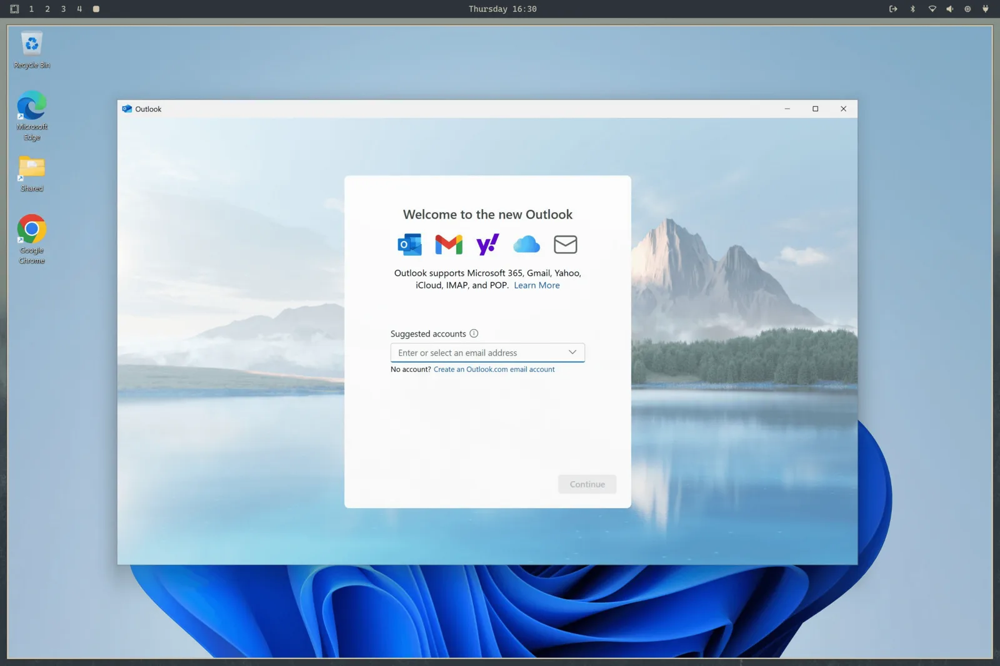

# Windows 虚拟机

codeOS 提供了一个通过 Docker VM 运行 Windows 的简便方式。从 codeOS 菜单（`Super + Space`）的 _Install > Windows_ 安装。

你的机器需要 KVM 虚拟化支持——大部分都有——但有时 BIOS 里关着，安装器会告诉你。你还需要磁盘空间：给 Windows 的大小，再加约 10GB 用于镜像本身。

安装器会问你要多少 RAM、多少 CPU 核心、多少磁盘（64GB 以上是合理下限），然后要 Windows 用户名和密码。留空的话默认是 `docker` / `admin`。下载需要一段时间——10-15 分钟正常——可以在浏览器里通过 `http://127.0.0.1:8006` 看进度。浏览器会要求同样的用户名密码才打开控制台。

 

## 使用

装好后，从应用启动器启动 _Windows_。如果 VM 没运行就会启动它，然后通过 RDP 全屏连接上。冷启动给它 15-30 秒。

RDP 会话带声音、麦克风和共享剪贴板，所以 Linux 和 Windows 之间复制文本直接就能用。分辨率跟随你的窗口大小，codeOS 会传递你的显示器缩放，HiDPI 屏幕上不会糊。

关闭 RDP 窗口时 VM 自动关机。如果想让它保持运行——比如里面跑着东西——改用 `omarchy windows vm launch --keep-alive` 启动。

其他控制也是这个命令：

```bash
omarchy windows vm status    # 运行了吗？
omarchy windows vm stop      # 关机
omarchy windows vm launch    # 启动并连接
```

## 文件共享

你的 home 目录下的 `~/Windows` 会自动共享给 VM。把文件放那里就能让 Windows 访问。VM 没有权限访问你文件系统的其他部分，所以 Windows 那边有什么不好的东西也不会传过来。它自己的虚拟磁盘在 `~/.windows`。

这些 home 路径各自在独立文件系统上。也可以是指向你自己目录的符号链接——当虚拟磁盘在更大的驱动器上时很有用。安装器测量的是真正包含 `~/.windows` 的那个文件系统的可用空间，不一定是你的 home 目录所在的。

把磁盘和共享路径保持为分离的、不重叠的目录。卸载时会故意清空磁盘目录但保留共享目录。删除前，codeOS 会执行一个有界的包含性检查，如果超时或无法证明两个目录树是分离的，就拒绝删除。

VM 启动前，codeOS 会打开并锁定这两个目录，然后把确切的目录 inode 绑定挂载到 `/var/lib/omarchy/windows/mounts` 下每个用户私有的锚点上。Docker 只能看到这些 root 保护的锚点。这样既保留了自定义磁盘位置，又防止另一个以你身份运行的进程在特权容器消费之前换掉被检查的路径。已有的磁盘和共享目录在迁移期间会收紧到 mode `0700`，这样其他本地账户无法浏览其内容。

VM 的端口只绑定到 localhost，所以你网络上的任何东西都访问不到 Windows 机器。web 控制台也需要配置的 Windows 用户名密码，防止其他本地账户通过 8006 端口驱动 VM。

## 限制与授权

这个设置没有 GPU passthrough，所以不适合游戏或视频剪辑。但跑 Microsoft Office 或其他你一定要有的东西非常合适。

安装的版本是未激活的 Windows 11 Pro。需要你自己的许可证密钥来解锁受限功能。

如果这台电脑自带 Windows，即使装了 codeOS 后 OEM 密钥还在固件里。用 `omarchy windows key` 打印出来。这个密钥绑定这台机器——可以激活重新装在这台硬件上的 Windows，但通常激活不了 VM。

之后可以重新运行 `omarchy-windows-vm install` 来改变资源分配，它会根据你的回答重写 VM 配置。Compose 文件本身现在在 `/var/lib/omarchy/windows/docker-compose.yml` 并且归 root 所有——这是故意的，防止以你身份运行的进程重写它让特权启动过程把你的整个磁盘挂载进容器。需要手动编辑的话（比如挂载 USB 设备），用 `sudo` 编辑，并查看 [Dockur Windows 项目](https://github.com/dockur/windows) 了解全部选项。

想彻底清掉，在 codeOS 菜单里选 _Remove > Windows_。会删除 VM 磁盘和所有数据，所以确保你在意的东西都搬出 `~/Windows` 了。
