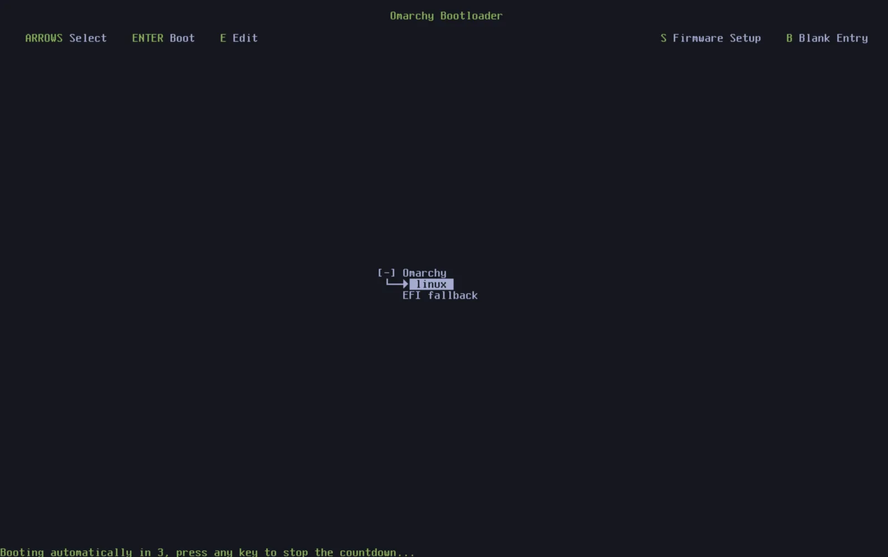

# 更新

codeOS 和你的软件包通过 codeOS 菜单（`Super + Space`）里的 _Update > Omarchy_ 保持最新。

codeOS 本身作为常规 pacman 包从 [Omarchy Package Repository](https://github.com/omacom-io/omarchy-pkgs) 安装，所以一次更新会安装 [最新 codeOS 版本](https://github.com/basecamp/omarchy/releases)、运行待执行的迁移来让系统和最新版同步，并从 [Omarchy Arch Mirror](https://github.com/omacom-io/omarchy-mirror) 和 [AUR](https://aur.archlinux.org/)（如果你装了 AUR 包）更新所有系统包。

有新版本发布时，时钟右边会出现一个圆形箭头图标。点击就开始更新流程。

### 四个通道

codeOS 通过四个通道更新：stable、RC、edge 和 dev。新安装默认走 stable 通道，跟踪 [官方发布](https://github.com/basecamp/omarchy/releases/)，加上 [stable Omarchy Arch mirror](https://github.com/omacom-io/omarchy-mirror)（落后最新版一个月），这样我们能在新不兼容问题影响用户之前提前发现。

但如果你想帮忙发现这些潜在问题，可以用 edge 通道。它让你的 codeOS 包跟踪最新开发版，并在 Arch 包一发布就可以更新。只有 Linux 经验丰富、知道怎么恢复有问题的系统的用户才该这么做。

每次大版本发布前，我们用 RC 通道做最终验证。如果有兴趣帮我们做最后打磨，来 Discord 的 #omarchy-release-candidates 频道坐坐。

最后是 dev 通道，直接把 codeOS 链接到 `~/omarchy` 里源码的 git checkout，加上 edge 包。这只有经验丰富的 Linux 用户、直接在开发 codeOS、愿意承担 breakage 风险的人才能用。

可以用 codeOS 菜单里的 _Update > Channel_（或终端里的 `omarchy-channel-set`）在通道之间切换。

### 固件更新

你的包不是唯一会过时的东西。很多笔记本和外设通过 Linux Vendor Firmware Service 提供 BIOS、SSD 和扩展坞固件，codeOS 菜单里的 _Update > Firmware_ 会拉取并安装你硬件上等待的更新。第一次运行时会装 `fwupd`。很多固件只能在重启时刷入，所以别惊讶它要你重启。

### 关于直接用 pacman/yay 更新的警告

如果你熟悉 Arch，可能想自己跑 `pacman -Syu` 或 `yay -Syu`，但那样会错过 codeOS 在更新包时一起做的快照、迁移和配置更新。所以 codeOS 实际上会阻止直接系统升级并引导你用 `omarchy update`。（如果你真的知道自己在做什么，保护机制会告诉你如何一次性绕过。）

### 回滚有问题的更新

如果更新后出了问题，可以把系统回滚到更新前自动拍的快照。重启后在引导菜单里选更新前的那个快照就行。

如果配置文件被损坏了，也可以在终端里用 `omarchy reinstall` 重新安装 codeOS。这会重装所有默认 codeOS 包、回到 stable、降级过新的包，并重置所有配置文件。注意你对 codeOS 默认做的用户配置修改会被覆盖！
