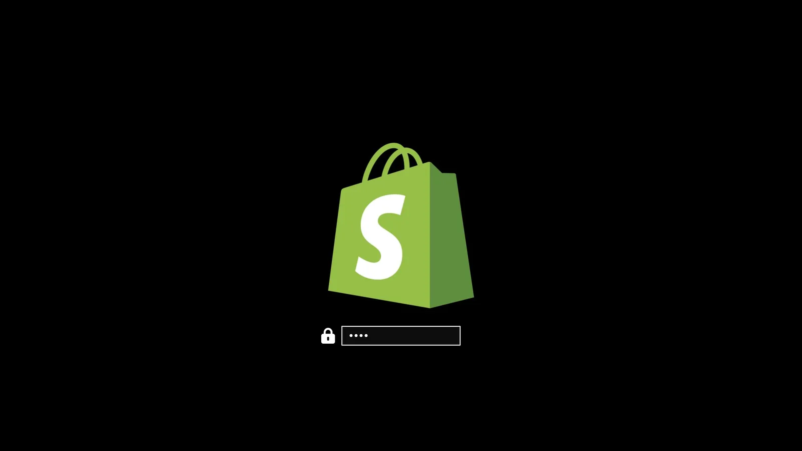

# 品牌定制

codeOS 允许你设置公司 logo 或个人图片，用于引导解锁、屏保和关于页面。

### 引导解锁

用 `omarchy plymouth preview` 预览自定义 logo 和颜色。接受背景色、文字色、logo png 和预览图片路径：

```
omarchy plymouth preview '#1d2021' '#ebdbb2' logo.png preview.png
```

然后用 `omarchy plymouth set '#1d2021' '#ebdbb2' logo.png` 应用设置，SDDM 登录界面也会用同样的颜色和 logo。想还原就 `omarchy plymouth reset`。

 

### 屏保

通过 _Style > Screensaver_ 改屏保的 logo。它是 ASCII logo，所以你可以直接编辑文字，也可以给它一张 png 或 svg，我们帮你转成 ASCII。看起来很酷。

 

菜单里有三项：

- **Edit Text** 在编辑器里打开 `~/.config/omarchy/branding/screensaver.txt`。输入或粘贴任何东西——ASCII 艺术、你的名字、一个不太文雅的词。保存退出后屏保立即生效让你看效果。
- **Set From Image** 打开文件选择器选 png 或 svg，转成 ASCII 并展示结果。轮廓清晰的 logo 比照片效果好得多。
- **Restore Default** 恢复 codeOS 默认 logo。

### 关于页面

_Style > About_ 下有同样三项，用于 codeOS 菜单里的 _About_ 页面，效果完全一样——文件是 `~/.config/omarchy/branding/about.txt`，每次改完 About 窗口都会弹出。About 艺术会转成比屏保更小的尺寸，因为要放在窗口里而不是填满整个显示器。

窗口打开时，每隔几秒会有一道绿光扫过艺术然后停下。你自己的艺术也会有，只要每个字符都是一列宽——任何通过 _Set From Image_ 生成的都满足。用 emoji 或双宽字符做的艺术会保持静止，保持 fastfetch 配置也是一样——这时静止 logo 是动画避开了它们而不是没成功，因为扫过会让后面的行错位。

 

### 自己转换图片

两个 _Set From Image_ 选项其实都是调用 `omarchy transcode ascii`，你也可以直接运行来控制转换过程：

```
omarchy transcode ascii ~/logo.svg ~/.config/omarchy/branding/screensaver.txt --width 100
```

接受 `--width` 和 `--height`（终端列数和行数）、`--mode`（`braille` 默认，更精细；或 `block`）、`--threshold` 百分比决定哪些像素算 logo 的一部分、`--invert` 当 logo 是深底亮字时反色。如果转换结果糊成一团，调 `--threshold` 通常有用。

### 用文字代替 logo

`omarchy ascii` 用 Delta Corps Priest 1（codeOS 自己的 wordmark 就是这个 FIGlet 字体）画文字，屏保可以显示一句话而不是图片：

```
omarchy ascii "Back in five" > ~/.config/omarchy/branding/screensaver.txt
```

接受多个参数作为文字，也可以从管道读。字体只有字母和空格——绘制时没有数字和标点符号——所以其他字符会被丢弃并在 stderr 里告知，而不是默默吞下。
