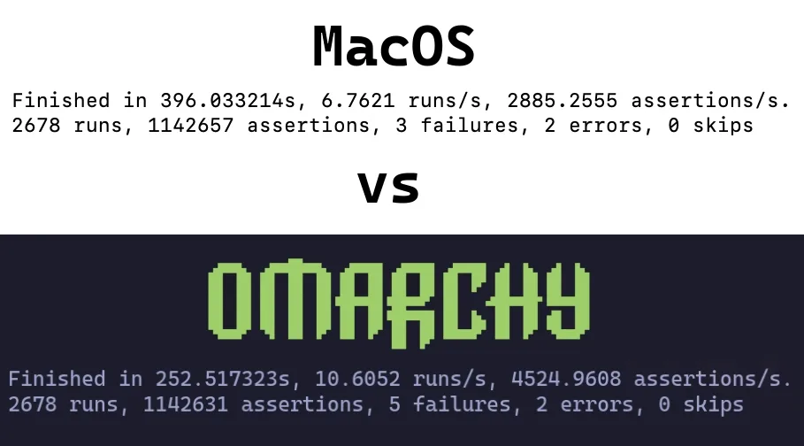

# Mac 支持

codeOS 内置支持 **Intel Mac**。目前有几个已知限制，但只要你了解并接受，就能给旧 Mac 注入新活力装上 codeOS。

注意 M 系列 Mac 目前不直接支持。更多状态可以在我们的 [Discord](https://discord.gg/tXFUdasqhY) 的 #omarchy-on-other 频道了解。

简单测试中，2019 款 MacBook Pro 装上 codeOS 后性能提升了 36%。

 

### 在 Mac 上安装 codeOS

codeOS 目前只支持作为 **唯一** 已安装的 OS。安装时会抹掉驱动器，macOS 不再可引导。

之后如果你想恢复，还是可以通过 Internet Recovery 恢复。

这部分假设你已经看完 [快速上手](02-getting-started.md) 并准备好了 U 盘。如果还没有，现在去做。

#### 禁用 Secure Boot

要引导可启动的 U 盘和操作系统，必须禁用 Apple 的 Secure Boot。步骤如下：

1. 关机
2. 开机时 _立即_ 按住 Command-R 直到看到加载画面
3. 选择用户，提示时输入密码
4. 进入恢复屏幕后，从菜单栏选 **Utilities > Startup Security Utility**
5. 提示认证时输入密码
6. Secure Boot 选项选 "No Security"
7. External Boot 选项选 "Allow booting from external or removable media"

#### 开始安装

1. 插入 U 盘
2. 重启 Mac 并 _立即_ 按住 Option 直到看到启动设备画面
3. 选择橙色的 EFI Boot 设备
4. 按[正常流程](02-getting-started.md)安装

安装器会检测 Mac 硬件并自动应用必要修复：Broadcom Wi-Fi 驱动和固件、需要的 MacBook 型号的 SPI 键盘驱动，以及同型号的 NVMe 挂起修复。

### 已知限制

社区成员在不断解决这些问题，所以如果这些对你有影响，来我们 [Discord](https://discord.gg/tXFUdasqhY) 的 #omarchy-on-other 频道看看有没有最新解决方法。

#### 带 T1 芯片的设备

Apple T1 芯片 2016 年底推出，只用于第一代带 Touch Bar 的 MacBook Pro。
- MacBook Pro 13-inch (2016, 两个 Thunderbolt 3 端口) – 型号: A1706
- MacBook Pro 13-inch (2016, 四个 Thunderbolt 3 端口) – 型号: A1708
- MacBook Pro 15-inch (2016) – 型号: A1707

#### 已知问题

- Touch Bar 不能用
- 声音不能用

#### 带 T2 芯片的设备

Apple T2 Security Chip 2017 年推出，2020 年向 Apple silicon（M 系列芯片）过渡后停产。

- iMac Pro (2017) – 型号: A1862
- MacBook Pro 13-inch (2018, 四个 Thunderbolt 3 端口) – 型号: A1989
- MacBook Pro 15-inch (2018) – 型号: A1990
- MacBook Air (Retina, 13-inch, 2018) – 型号: A1932
- Mac mini (2018) – 型号: A1998
- MacBook Pro 13-inch (2019, 两个 Thunderbolt 3 端口) – 型号: A2159
- MacBook Pro 13-inch (2019, 四个 Thunderbolt 3 端口) – 型号: A2178
- MacBook Pro 15-inch (2019) – 型号: A1990
- MacBook Pro 13-inch (2020, 两个 Thunderbolt 3 端口) – 型号: A2265
- MacBook Pro 15-inch (2020) – 型号: A1990

在这些型号上，安装器自动设置好补丁版 `linux-t2` 内核、T2 音频配置、Apple 的 Broadcom Wi-Fi/Bluetooth 固件，以及通过 `t2fanrd` 控制风扇。Touch Bar 靠内核内置的 Boot Camp 风格支持工作。
