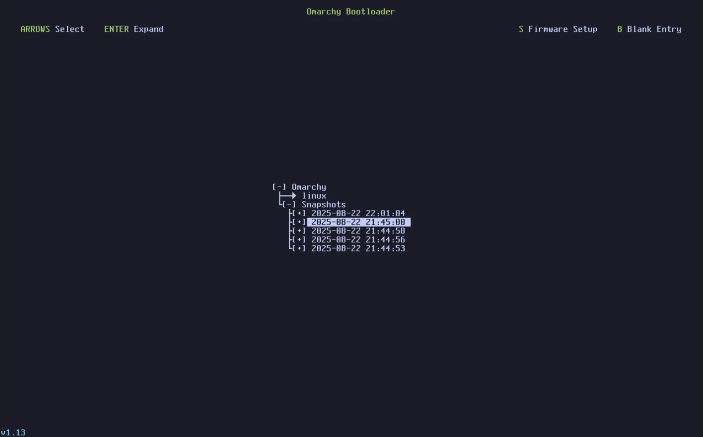
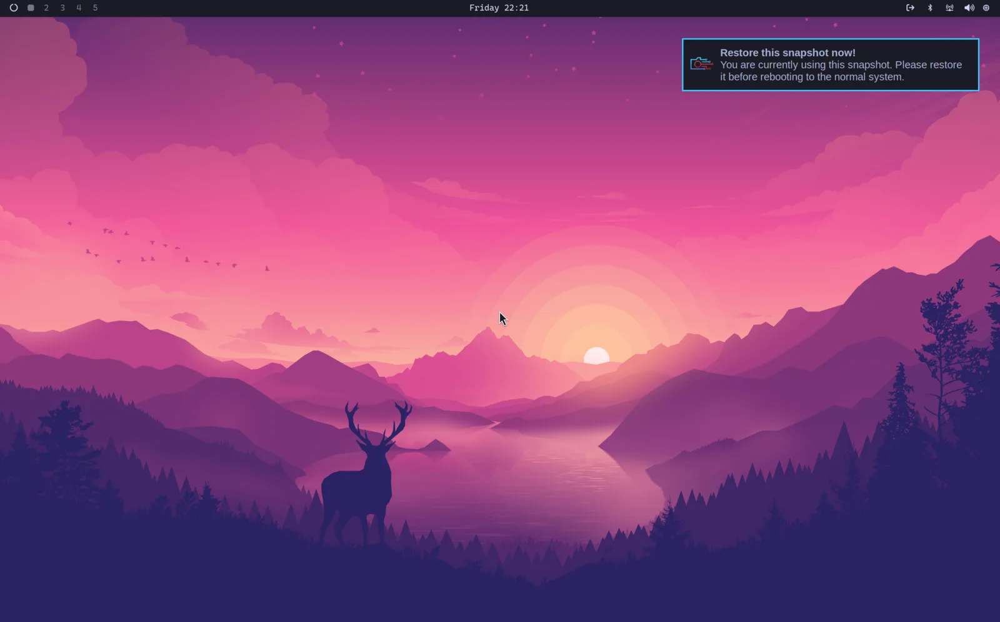

# 系统快照

每次 codeOS 更新时会自动创建快照，但如果你想手动创建，用 `omarchy-snapshot create`。

要引导恢复快照，在 Limine 引导加载器里选。（如果你现在直接进 codeOS 解密屏幕，需要先通过 BIOS 把 Limine 选为引导选项）。

在那个屏幕里，根据日期和版本选你想引导的快照。快照时的 codeOS 版本显示在左下角。

 

引导进去后，会弹出通知告诉你正在引导一个快照，点击就开始恢复流程。或者用 `omarchy-snapshot restore`。

 

这会恢复你的根文件系统，但 **不会** 恢复 `/home`。所以适合回滚有问题的系统更新，但不是恢复丢失的个人文件。

这也意味着你的 `~/.config` 目录保持原样。所以如果你回滚到了一个早期版本的库或应用——但它用的配置文件格式已经变了——需要手动处理。

_注意：这个功能只在使用 Limine 引导加载器的安装上可用，codeOS 2.0 起默认就是。如果你用 GRUB 或 systemd-boot 就没有。_

### 跳过引导菜单

如果你从不碰引导菜单，想让机器直接跳进解密屏幕，在 codeOS 菜单里运行 _Setup > Direct Boot_。它会加一个直接指向 codeOS 的 EFI 条目，固件会不经 Limine 直接引导。

代价就是开头说的：开了直接引导后，想进快照就得先从 BIOS 引导菜单选 Limine。再跑一次 _Setup > Direct Boot_ 可以去掉条目恢复通过 Limine 引导。有些固件对自定义 EFI 条目不太友好，所以 American Megatrends 和 Apple 固件上这个设置不会运行。
