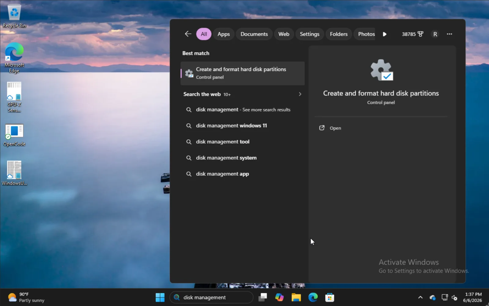
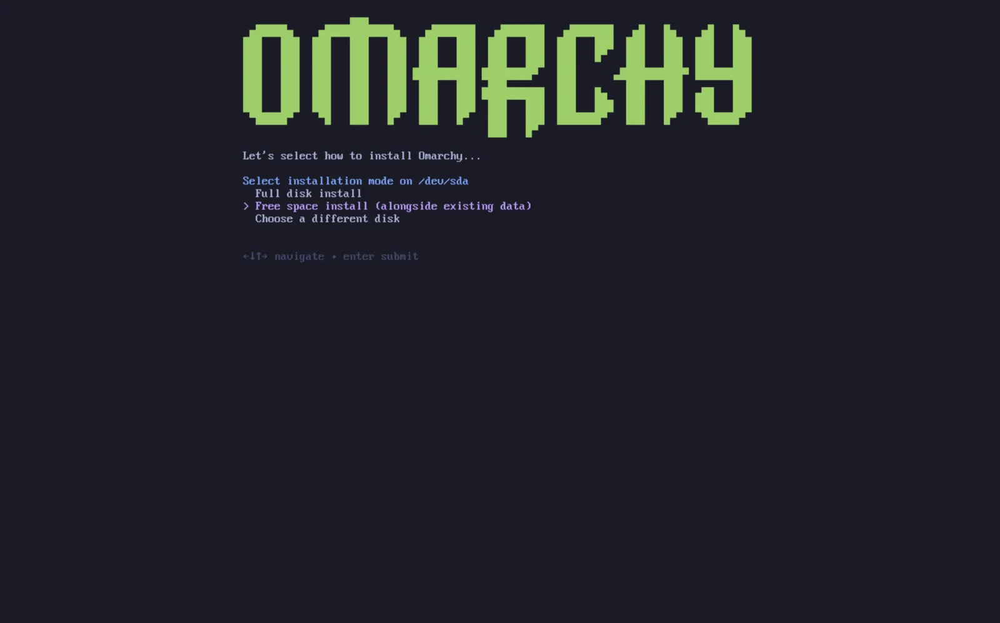
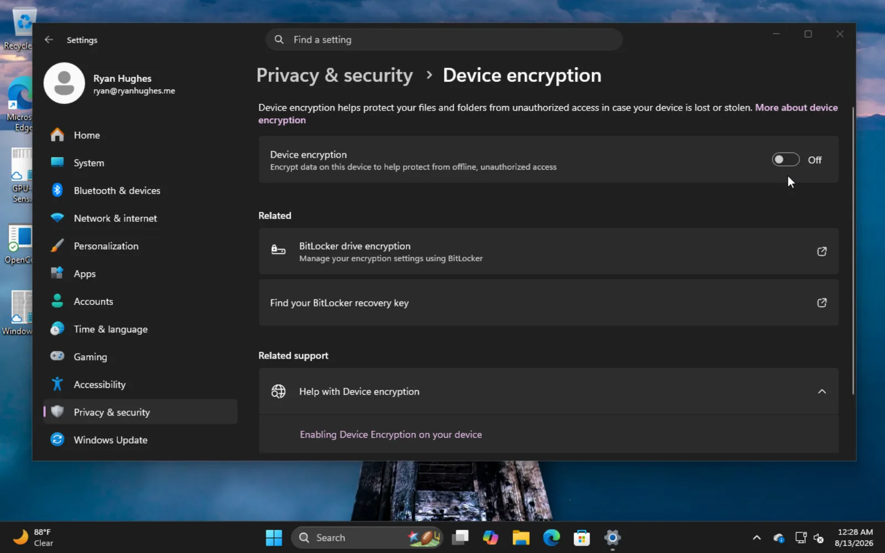

# 双引导安装

你可以在磁盘上分出一个单独分区，和 Windows 或其他系统并存安装 codeOS。

这种安装方式仍然默认对该分区使用 LUKS 加密，所以和全盘安装安全上没区别，只是需要磁盘上有空闲空间。

## 在 Windows 上腾出空间

想和 Windows 并存安装，在开始菜单输入 `磁盘管理`，选 **创建并格式化硬盘分区**。

 

找到合适的分区，右键选 **压缩卷**。

输入要压缩出的空间大小——这就是你未来 codeOS 安装的大小（含引导分区）。

 

完成后应该像这样，例子里 50GB 那块就是我们要装 codeOS 的地方。

 

## 安装 codeOS

codeOS 的安装流程和正常一样。选好磁盘后，会给你一个 **Free space install** 选项。选那个就不会抹整个磁盘。

 

确认一切正常，等安装完成，和正常流程一样。这里也可以选择不加密安装（不推荐），和全盘安装一样。
 

## 在引导加载器里添加其他系统

codeOS 安装完后，Limine 引导加载器就成了默认。你也可以用 Limine 给其他系统加选项，比如 Windows。

做法是运行 `limine-scan`，按提示把想加的条目加到 Limine 配置里。之后启动时就会看到 codeOS 选项，也会有 Windows Boot Manager 或其他。

## Bitlocker

注意这个安装方式和 Bitlocker 不兼容——它加密整个驱动器而不是单独分区。如果遇到 Bitlocker 已开启的错误，启动进 Windows，到 **设置 -> 隐私和安全性 -> 设备加密** 关掉 Bitlocker。解密整个驱动器可能需要一些时间。

 
